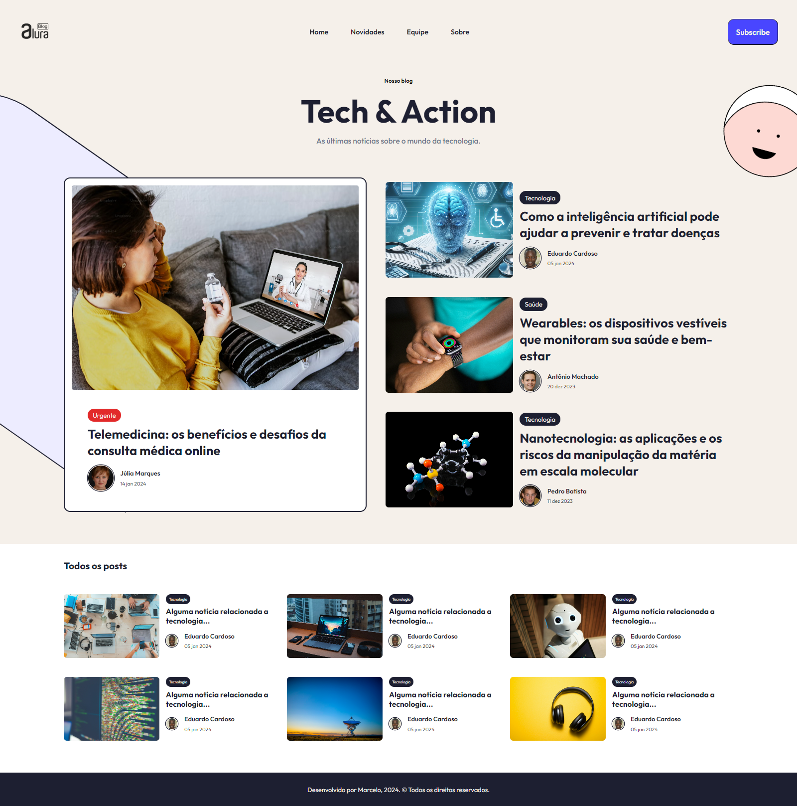

# Sobre o projeto
A ideia é baseada no desafio mão na massa, onde foi pedido para criar um blog testando as tags e as estilizações do CSS.

A ideia era fazer um projeto simples apenas para por em prática o que foi aprendido, sem muito refinamento na estrutura do blog em si.

As manchetes foram geradas pela inteligência artificial Copilot da Microsoft.

Algumas imagens como o logo e o smile, foram criadas por mim, utilizando o Photoshop. As imagens das notícias foram pegas no site [Unsplash](https://unsplash.com/pt-br).

Apenas desenvolvi a home page, sem muito compromisso de fazer um blog completo, portanto várias funcionalidades são apenas enfeite.

O site também sofre um pouco na performance, devido a quantidade de imagens e muito código html, a situação ideal com toda certeza, seria usar algum framework de front-end para que o blog fosse melhor otimizado. <b>Mas lembrando é apenas um desafio experimental.</b>

## Imagem do projeto

## Créditos
A ideia de layout do projeto foi através do Dribbble pelo [link](https://dribbble.com/shots/18064353-Blog-home) do autor <b>[Jubeo](https://dribbble.com/jubeo)</b>.