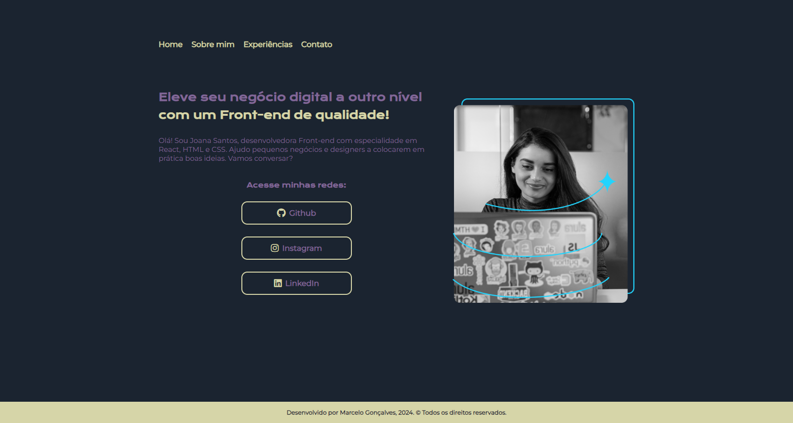
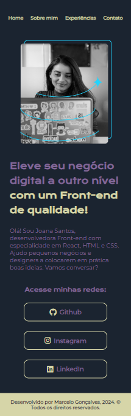

# 🧩 Sobre o projeto

Projeto de portfólio utilizando HTML e CSS para mobile e desktop.

## 🤔 O que encontro no projeto?

Projeto feito utilizando "mobile first", com toda a página modelada do mobile e depois ajustando as páginas na versão desktop. Além das páginas base home e sobre mim, adicionei as páginas de experiências e contato.

Outra adição ao projeto foi um elemento de animação com keyframes no CSS para o home, além de alguns hovers que não tinham no projeto original. Outra mudança foi a utlização de ícones nos botões de âncora, ao invés de imagens, utilizei o [Font Awesome](https://fontawesome.com/), que disponibiliza icones de uma maneira mais simples e que também já estou habituado a usar. A paleta de cores foi pega do colorhunt na aba "dark".

O projeto ainda não é 100% pessoal, ainda farei um novo projeto com as minhas informações e dados, mas a priori foi apenas conclui o desafio dos cursos e deixar similar ao que foi proposto no [Figma](https://www.figma.com/file/NrzJacC887svMVfF9oC2jM/Portfolio-Projeto-2?type=design&node-id=0-1&mode=design&t=OVhDCPUIqRqqcjrz-0).

## 📸 Imagens do projeto

<h4>Versão Desktop</h4>

<h4>Versão Mobile</h4>
